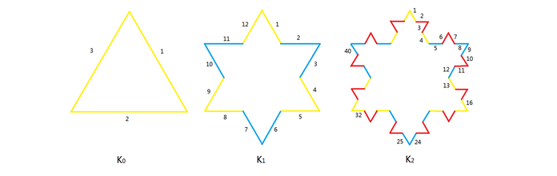

### Description: Koch Snowflake

Koch Snowflake is one of the most famous factal. It is built by starting with an equilateral triangle, removing the inner third of each side, building another equilateral triangle at the location where the side was removed, and then repeating the process indefinitely.

Let Kn be the Koch Snowflake after n-th iteration. It is obvious that the number of sides of Kn, Nn, is 3*(4^n). Let's number the sides clockwisely from the top of Koch Snowflake.

Let S(i,n) be the i-th side of Kn. The generation of si,n is defined as the smallest m satifying S(i,n) is a part of the sides of Km. For example, in the above picture, the yellow sides are of generation 0; the blue sides are of generation 1; the red sides are of generation 2.

Given a side S(i,n), your task is to calculate its generation.

##### **input**
The input contains several test cases.
The first line contains T(T <= 1000), the number of the test cases.
The following T lines each contain two numbers, i(1 <= i <= 10^9) and n(0 <= n <= 1000). Your task is to calculate the generation of side S(i,n).

##### **Output**
For each test case output the generation of the side.

### My Solution

Notice that S(i, n) -> S(i % 4 + i / 4, n - 1) if and only if i % 4 == 0 || i % 4 == 1
so just recursion until n == 0 || !(i % 4 == 0 || i % 4 == 1) :smile:
