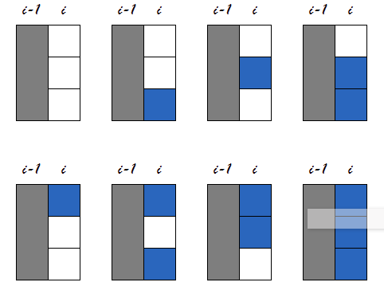
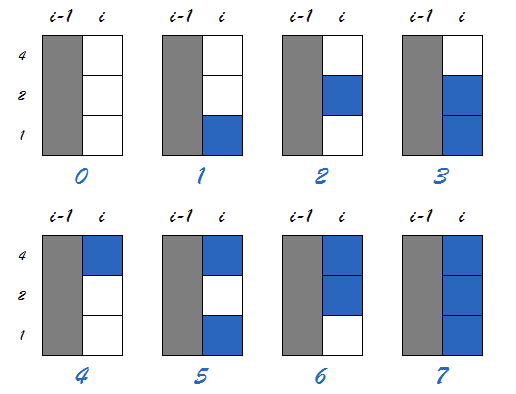
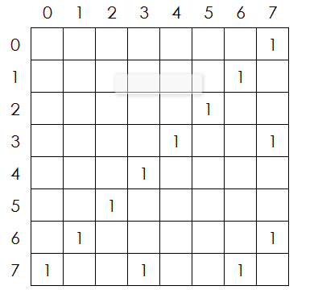

### Description: Dominocoverage II             

We have solved 2*N Dominocoverage, this week we try to solve the 3*N Dominocoverage by 1*2 domino.

- input : 1 <= N <= 100000000
- output: result % 12357
 
### Solution from hiho

*Hint: if N % 2 == 1, it can't be coveraged by 1*2 domino. *

For 2*N, we can write a simple recursion formula, but for 3*N, it is so hard to wirte one, I give up after some attempts. There are two method to solve 2*N dominocoverage, the second method use state transition matrix, maybe it is also works here.

The current row must be one of the follow forms:

encode them:

Then, we must decide how can state row i transfer to state row i+1, the key points is we must only put domino on row i+1, it can guarantee this is no reduplications.

and the start state is (0,0,0,0,0,0,1)
